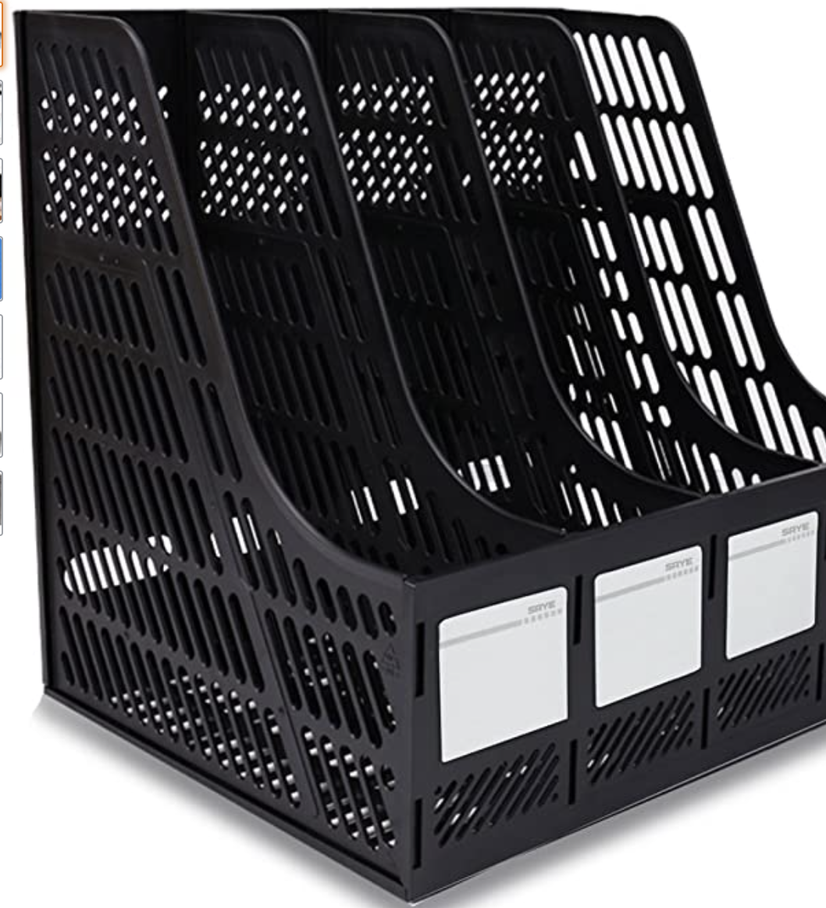

# organise files 



## Description

Simple command line utility script that I use to organise my ~/Download and ~/Desktop folders by file types.

## Development Info

### Run
```
pip install -r requirements.txt
python organise_files.py
```

### Testing
```
pytest
```